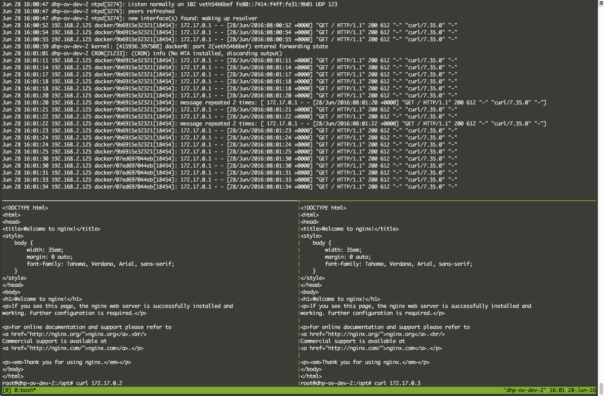
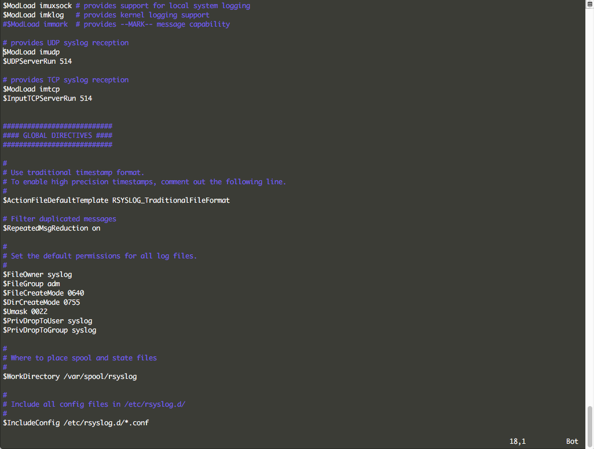

# Syslog

## 介绍

Syslog 是操作系统中提供的一种日志收集方式。

您可以通过 Syslog 收集和索引 DCE 集群中容器的日志信息。



## 前期准备

要用于收集日志的话，首先您可以通过 rsyslog 创建并暴露一个或多个端口用于接收日志。

一般 Linux 操作系统中的 rsyslog 的配置文件位于 `/etc/rsyslog.conf`，你可以通过修改这个配置文件配置端口信息。



## 使用

您可以使用 Syslog 来收集容器的日志。

在启动容器时，可以通过指定 `log-driver` 来指定容器的日志引擎：

*假设您的 rsyslog 位于 `192.168.2.125`，且使用 udp 协议的 514 端口。*

```
docker run -d --log-driver=syslog --log-opt syslog-address=udp://192.168.2.125:514 daocloud.io/nginx
```

您也可以使用 Docker Compose 来管理应用的日志引擎：

```yaml
version: '2'
services:
  nginx:
    image: daocloud.io/nginx
    logging:
      driver: syslog
      options:
        syslog-address: udp://192.168.2.125:514
```

参考:

* [Docker 集成日志服务器](https://docs.docker.com/engine/admin/logging/overview/)